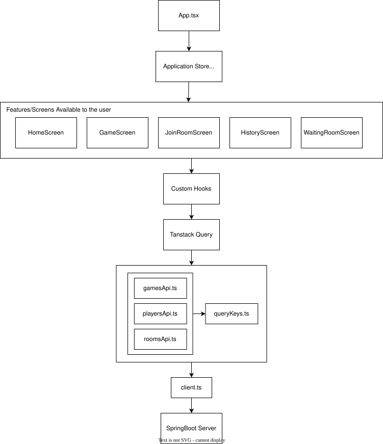

# Tic-Tac-Toe React Migration

This project contains the proposed structure for converting the existing
vanilla JavaScript Tic-Tac-Toe application to React and TypeScript. The current
task focuses on preparing the structure, dependencies, API layer, and WebSocket
setup. The remaining design and game behavior will be migrated later.

## Technology to be used

- React with TypeScript
- Vite
- Tailwind CSS
- Zustand
- TanStack Query
- STOMP WebSocket client

Zustand will manage client-side state shared across features, such as the
active screen and game session. TanStack Query will manage data coming from the
Spring Boot service, including rooms, games, boards, players, and history.

## Project structure

```text
└── tictac-toe-react
    └── public
        ├── favicon.ico
    └── src
        └── api
            ├── client.ts
            ├── gamesApi.ts
            ├── playersApi.ts
            ├── queryKeys.ts
            ├── roomsApi.ts
        └── assets
            ├── fonts
            │   └── sampleFont.txt
            └── icons
                └── actions
                    ├── quit.svg
                └── results
                    ├── draw.svg
                    ├── loss.svg
                    ├── win.svg
                └── status
                    ├── streak.svg
            └── mascots
                └── cat
                    ├── crying.svg
                    ├── idle.svg
                    ├── peeking.svg
                └── dog
                    ├── crying.svg
                    ├── idle.svg
                    ├── peeking.svg
            ├── index.ts
        └── components
            └── feedback
                ├── Toast.tsx
            └── game
                ├── Mascot.tsx
                ├── PlayerRoleNote.tsx
            └── navigation
                ├── BackButton.tsx
            └── ui
                ├── Button.tsx
                ├── Modal.tsx
                ├── TextInput.tsx
        └── features
            └── create-room
                └── components
                    ├── CreateRoomForm.tsx
                └── hooks
                    ├── useCreateRoom.ts
                ├── CreateRoomScreen.tsx
            └── game
                └── components
                    ├── Board.tsx
                    ├── GameResultModal.tsx
                    ├── GameTopBar.tsx
                    ├── PlayerScoreCard.tsx
                    ├── QuitGameModal.tsx
                    ├── ReconnectingModal.tsx
                    ├── Scoreboard.tsx
                    ├── SpectatorBanner.tsx
                    ├── TurnIndicator.tsx
                    ├── VersusIntro.tsx
                └── hooks
                    ├── useAddMove.ts
                    ├── useBoard.ts
                    ├── useGame.ts
                    ├── useLeaveRoom.ts
                    ├── usePlayAgain.ts
                ├── GameScreen.tsx
            └── history
                └── components
                    ├── GameList.tsx
                    ├── HistoryState.tsx
                    ├── HistoryTabs.tsx
                    ├── MoveList.tsx
                    ├── PlayerList.tsx
                    ├── ReplayBoard.tsx
                    ├── ReplayControls.tsx
                    ├── RoomList.tsx
                └── hooks
                    ├── useHistory.ts
                ├── HistoryScreen.tsx
            └── home
                └── components
                    ├── HomeActions.tsx
                    ├── HomeHero.tsx
                    ├── HowToPlayModal.tsx
                    ├── IdleNudge.tsx
                ├── HomeScreen.tsx
            └── join-room
                └── components
                    ├── JoinRoomForm.tsx
                └── hooks
                    ├── useJoinRoom.ts
                ├── JoinRoomScreen.tsx
            └── waiting-room
                └── components
                    ├── RoomCodeCard.tsx
                    ├── WaitingStatus.tsx
                └── hooks
                    ├── useRoom.ts
                ├── WaitingRoomScreen.tsx
        └── store
            ├── useAppStore.ts
        └── types
            ├── game.ts
            ├── history.ts
        └── websocket
            ├── stompClient.ts
            ├── useGameRealtime.ts
        ├── App.tsx
        ├── config.ts
        ├── index.css
        ├── main.tsx
```

## Folder organization

### `api`

Contains the REST client, endpoint functions, and TanStack Query keys. Keeping
this outside the UI prevents components from calling `fetch` directly.

### `assets`

Contains the font assets, icons, and mascot SVGs used by the application. The
files are grouped by purpose, while reusable icons and mascot images are
exported through `assets/index.ts`.

### `components`

Contains components shared by more than one feature. This includes basic UI,
navigation, feedback, the mascot, and the player-role note used by both room
forms. Components used by only one feature stay inside that feature.

### `features`

Each feature represents one user workflow and keeps its screen, local
components, and hooks together. This prevents the screen files from becoming
too long while making related files easy to find.

```text
features/
├── create-room/
│   ├── components/
│   │   └── CreateRoomForm.tsx
│   ├── hooks/
│   │   └── useCreateRoom.ts
│   └── CreateRoomScreen.tsx
├── game/
│   ├── components/
│   │   ├── Board.tsx
│   │   ├── GameResultModal.tsx
│   │   ├── GameTopBar.tsx
│   │   ├── PlayerScoreCard.tsx
│   │   ├── QuitGameModal.tsx
│   │   ├── ReconnectingModal.tsx
│   │   ├── Scoreboard.tsx
│   │   ├── SpectatorBanner.tsx
│   │   ├── TurnIndicator.tsx
│   │   └── VersusIntro.tsx
│   ├── hooks/
│   │   ├── useAddMove.ts
│   │   ├── useBoard.ts
│   │   ├── useGame.ts
│   │   ├── useLeaveRoom.ts
│   │   └── usePlayAgain.ts
│   └── GameScreen.tsx
├── history/
│   ├── components/
│   │   ├── GameList.tsx
│   │   ├── HistoryState.tsx
│   │   ├── HistoryTabs.tsx
│   │   ├── MoveList.tsx
│   │   ├── PlayerList.tsx
│   │   ├── ReplayBoard.tsx
│   │   ├── ReplayControls.tsx
│   │   └── RoomList.tsx
│   ├── hooks/
│   │   └── useHistory.ts
│   └── HistoryScreen.tsx
├── home/
│   ├── components/
│   │   ├── HomeActions.tsx
│   │   ├── HomeHero.tsx
│   │   ├── HowToPlayModal.tsx
│   │   └── IdleNudge.tsx
│   └── HomeScreen.tsx
├── join-room/
│   ├── components/
│   │   └── JoinRoomForm.tsx
│   ├── hooks/
│   │   └── useJoinRoom.ts
│   └── JoinRoomScreen.tsx
└── waiting-room/
    ├── components/
    │   ├── RoomCodeCard.tsx
    │   └── WaitingStatus.tsx
    ├── hooks/
    │   └── useRoom.ts
    └── WaitingRoomScreen.tsx
```

- `create-room`: `CreateRoomScreen` coordinates the workflow,
  `CreateRoomForm` handles the form UI, and `useCreateRoom` contains the room
  creation mutation.
- `game`: `GameScreen` coordinates gameplay. Its components divide the board,
  top bar, scoreboard, player cards, turn indicator, spectator message, versus
  introduction, and result/quit/reconnection dialogs. Its hooks separate board
  and game queries from the add-move, leave-room, and play-again mutations.
- `history`: `HistoryScreen` coordinates room and player history. Its components
  handle tabs, room/player/game/move lists, loading or empty states, and replay
  controls, while `useHistory` contains the related queries.
- `home`: `HomeScreen` composes `HomeHero`, `HomeActions`, `HowToPlayModal`, and
  `IdleNudge`. These components separate the landing-page content from its
  optional interactions.
- `join-room`: `JoinRoomScreen` combines `JoinRoomForm` with `useJoinRoom`,
  keeping the form UI separate from the join mutation.
- `waiting-room`: `WaitingRoomScreen` composes `RoomCodeCard` and
  `WaitingStatus`, while `useRoom` loads the current room information.

Each feature owns components that are specific to its workflow. Keeping these
components beside the screen that uses them makes their purpose and ownership
clear, prevents the shared `components` folder from becoming crowded, and
allows a feature to change without affecting unrelated parts of the app.

For example, `GameScreen` coordinates the complete game view but delegates
focused UI responsibilities to `Board`, `GameTopBar`, `Scoreboard`,
`PlayerScoreCard`, `TurnIndicator`, `SpectatorBanner`, `VersusIntro`, and the
game modals inside `features/game/components`. Data access and game commands
are delegated to `useBoard`, `useGame`, `useAddMove`, `useLeaveRoom`, and
`usePlayAgain`. These files stay in the `game` feature because no other
workflow needs them. A component such as `Mascot`, however, belongs in the
top-level `components` folder because it can be reused by multiple features.

The `game` feature is structured as follows:

```text
game/
├── components/
│   ├── Board.tsx
│   ├── GameResultModal.tsx
│   ├── GameTopBar.tsx
│   ├── PlayerScoreCard.tsx
│   ├── QuitGameModal.tsx
│   ├── ReconnectingModal.tsx
│   ├── Scoreboard.tsx
│   ├── SpectatorBanner.tsx
│   ├── TurnIndicator.tsx
│   └── VersusIntro.tsx
├── hooks/
│   ├── useAddMove.ts
│   ├── useBoard.ts
│   ├── useGame.ts
│   ├── useLeaveRoom.ts
│   └── usePlayAgain.ts
└── GameScreen.tsx
```

The main files are named `HomeScreen`, `GameScreen`, and similar because
they represent the full UI shown for a feature. The folder uses the name
`features` because it owns more than the screen itself.

### `store`

Contains the Zustand store for the active screen and current game session.
Backend data such as boards, players, and scores stays in TanStack Query.

### `types`

Contains TypeScript definitions shared by the API, features, store, and
WebSocket handlers. The types follow the Spring Boot request and response
formats.

### `websocket`

Contains the shared STOMP connection and realtime subscriptions. It remains
outside a single feature because both Waiting Room and Game use it.

## REST and WebSocket flow

REST is used for commands and initial loading. STOMP events provide live room
and game updates.

1. A room is created or joined through REST.
2. Initial room, game, and board data is loaded through REST.
3. Joins, moves, completed games, and new rounds arrive through STOMP.
4. The event payload updates or refreshes the related TanStack Query cache.

This removes the need to poll the backend for room or board changes.

## High-Level API Call Architecture



The diagram shows the main REST data flow. `App.tsx` uses the Zustand store to
select the active feature screen. Screens delegate server operations to custom
hooks, which use TanStack Query for request state and caching before calling the
resource-specific API modules. Those modules share `client.ts` to communicate
with the Spring Boot server. Realtime STOMP events follow the WebSocket flow
described above and update the same TanStack Query cache.
